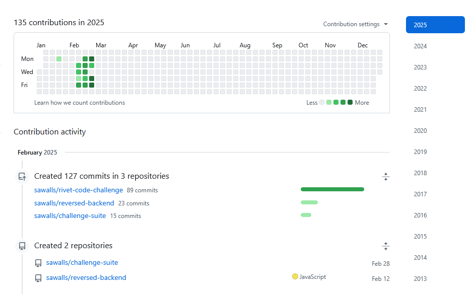
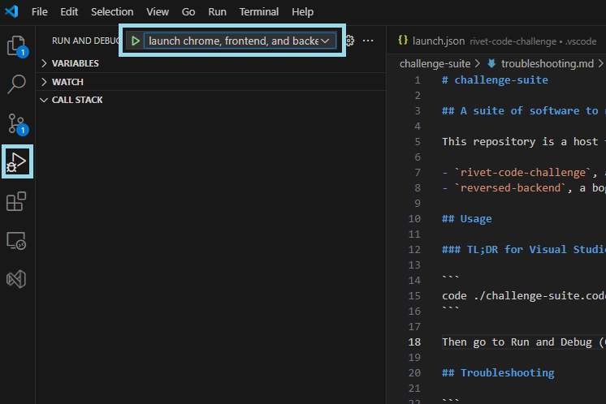
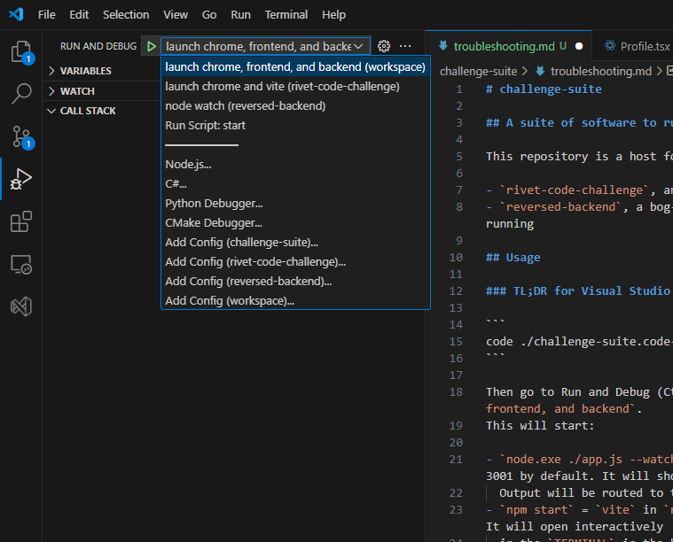

<p align="center" width="100%">
  
</p>

## A suite of software to run Schala's souped up coding challenge

This repository is a host for two submodules:

- `rivet-code-challenge`, an enhanced version of the coding challenge I originally provided
- `reversed-backend`, a bog-simple node.js/express in-memory server because the demo backend server is not running

You can find their individual github repositories here:

- <https://github.com/sawalls/rivet-code-challenge>
- <https://github.com/sawalls/reversed-backend>

<video controls>
  <source type="video/mp4" src="https://filedn.com/lGIIm4sv6fGXUrnpi6dK4E7/full-demo-video.mp4">
</video>

## OK, but why does it exist?

Recovery is going well, I have a decent amount of time, and it's embarrassing but I want my job back. I figured it was worth spending a sprint's worth of work proving that I'm dedicated and have the skills.
I looked around for a way to do it, and cleaning up some of the "should do"s of my original coding
challenge seemed to fit the bill as a way to show off.

<p align="center" width="100%">
  
</p>

I've tried to make the tech stack as similar to what I was using on the job as possible.
The message here is that I could be fully up to speed and solving problems tomorrow,
no additional training required. If anything in this repository doesn't work, doesn't make sense,
or you'd just like to talk about it, please contact me.

## Installation

Running the suite requires `git >= v2.13`, `node >= v22.13.0`, and `11.0.0`.

```
git clone --recurse-submodules -j8 git@github.com:sawalls/challenge-suite.git
npm i
```

I'm not sure which using or _not_ using git submodules is a sin. Either way it can be a bit difficult to
configure, so I'm sorry for the overhead. I haven't needed anything that wasn't in the book chapter:
https://git-scm.com/book/en/v2/Git-Tools-Submodules

`npm install` in the `challenge-suite` directory will install in the submodules:

```
npm i
> challenge-suite@1.0.0 install
> cd ./reversed-backend && npm install && cd ../rivet-code-challenge && npm install
```

But you can also run manually per package:

```
cd rivet-code-challenge && npm i
```

```
cd reversed-backend && npm i
```

## Usage

### TL;DR for Visual Studio Code

```
code ./challenge-suite.code-workspace
```

Then go to Run and Debug (Ctrl+Shift+D on Windows) and select the launch configuration: `launch chrome, frontend, and backend`.

<p align="center" width="100%">
  
</p>

This will start:

- `node ./app.js --watch` in `reversed-backend` which will start the express backend listening on port 3001 by default. It will show up in the Run and Debug `CALL STACK` tray as `app.js`
  Output will be routed to the `DEBUG CONSOLE` in the bottom panel.
- `npm start` = `vite` in `rivet-code-challenge` which will start the frontend served from vite dev server. It will open interactively
  in the `TERMINAL` in the bottom panel. Vite has useful hotkeys you can check out with `h + enter` on the `TERMINAL`
- Chrome. When launched in this way, Code has access to the debugger of Chrome, so breakpoints inside `rivet-code-challenge`
  should pause your execution in the `schalfile` entry in the Run and Debug `CALL STACK` tray

<p align="center" width="100%">
  
</p>

The combination configuration is set to stopAll, so if you close either of the frontend, or the backend,
the other will close, along with chrome and the bottom panel. You can make personal changes to launch.json
as desired.

If you need to run components individually, with `challenge-suite.code-workspace` loaded, you have direct
access to the launch.jsons of the individual projects, as well, so you can launch, e.g. `node watch`, which
runs `node ./app.js --watch`

<p align="center" width="100%">
  
</p>

### TL;DR for console

`npm start` in `challenge-suite` should run a `concurrently` of the two projects. You won't have access to the `vite` keyboard commands, however.

## Documentation

This `README.md` that you're reading right now is meant to be read both through text and through
the Github repository page. Github renders markdown with Redcarpet. I recommend making a branch
for changes and using the Preview in the built-in markdown editor for Github, since you
can see it in context that way, but there's a python tool called `grip` that I sometimes use to check.

However, for the actual Github _page_, Github has provided instructions on how to render locally.
If you're interested in doing so, install Jekyll locally, `bundle install`, then run

```
bundle exec jekyll serve --baseurl=""
```

You should get a prompt telling you how to access the static content it's serving. It's _almost_
100% accurate to what shows up on Github. I haven't noticed any differences that change anything
meaningful.

Github does _something_ to render README.md as the default as a fallback. I like having one source
of truth that's also terminal-readable, so I used the `jekyll-readme-index` plugin to replicate
that behavior.

If you change README.md, please make sure it renders pleasantly as a Jekyll page _and_ as a
github page.

## Troubleshooting

```
Debugger attached.
Waiting for the debugger to disconnect...
node:internal/errors:496
    ErrorCaptureStackTrace(err);
    ^

Error [ERR_MODULE_NOT_FOUND]: Cannot find package 'express' imported from .\challenge-suite\reversed-backend\app.js
    at new NodeError (node:internal/errors:405:5)
    at packageResolve (node:internal/modules/esm/resolve:782:9)
    at moduleResolve (node:internal/modules/esm/resolve:831:20)
    at defaultResolve (node:internal/modules/esm/resolve:1036:11)
    at DefaultModuleLoader.resolve (node:internal/modules/esm/loader:251:12)
    at DefaultModuleLoader.getModuleJob (node:internal/modules/esm/loader:140:32)
    at ModuleWrap.<anonymous> (node:internal/modules/esm/module_job:76:33)
    at link (node:internal/modules/esm/module_job:75:36) {
  code: 'ERR_MODULE_NOT_FOUND'
}

Node.js v20.5.0
Waiting for the debugger to disconnect...
```

Run `npm i` inside of `./reversed-backend`

```
npm start
Debugger attached.

> code-challenge-starter@0.1.0 start
> vite

'vite' is not recognized as an internal or external command,
operable program or batch file.
Waiting for the debugger to disconnect...
```

Run `npm i` inside of `./rivet-code-challenge`
